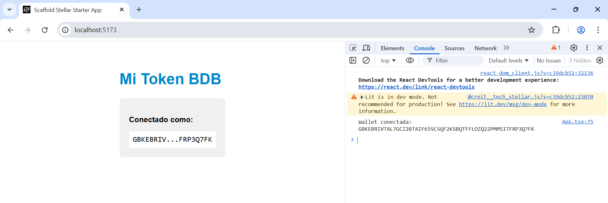
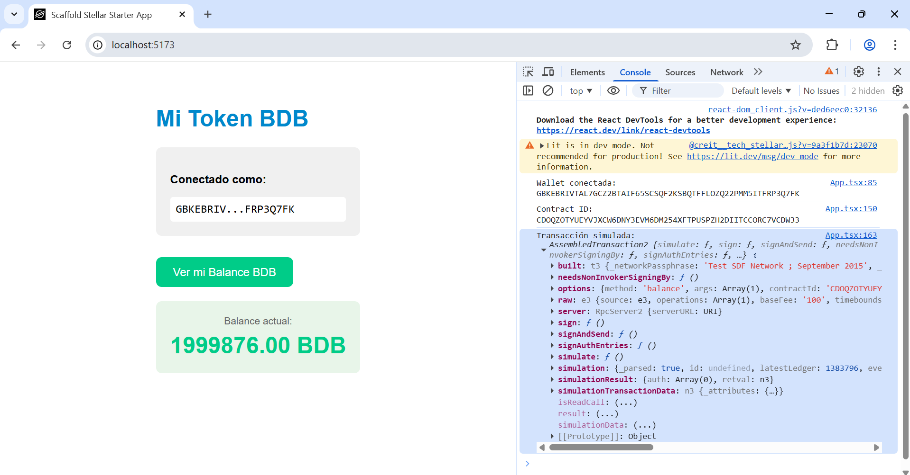
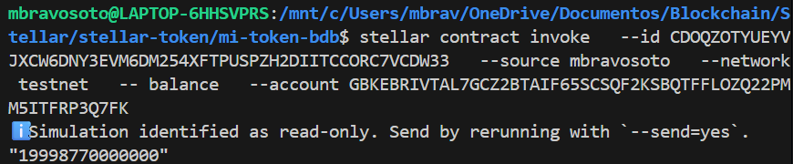
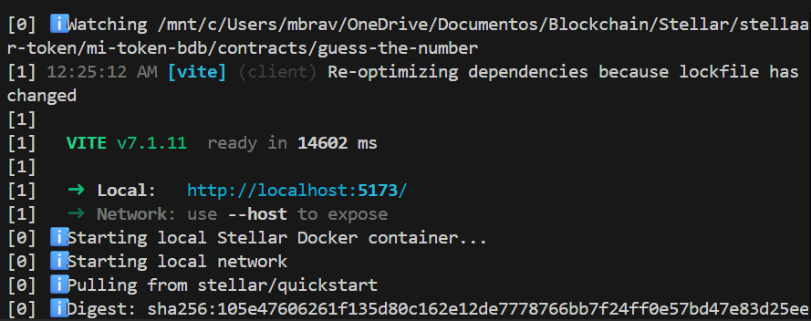
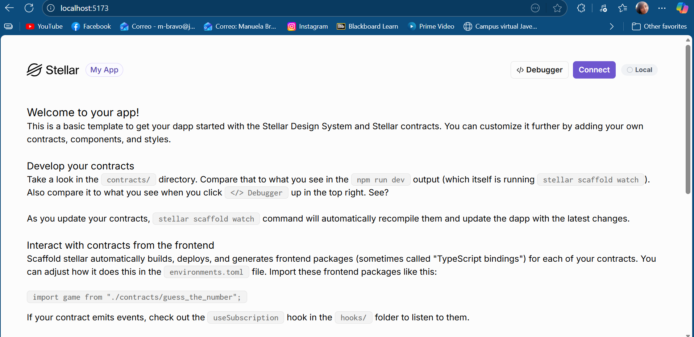

# 🌟 Soroban Token BDB – Full Stack Project

This project combines a CAP-46 compliant Soroban smart contract designed to create and manage a token on the Stellar Testnet, a frontend built with Scaffold Stellar, and Freighter wallet integration for secure user authentication. Once the wallet is connected and the user's public key is available, the interface allows users to retrieve and display their token balance in real time.

Explore the deployed contract on [Stellar Expert](https://stellar.expert/explorer/testnet/contract/CDOQZOTYUEYVJXCW6DNY3EVM6DM254XFTPUSPZH2DIITCCORC7VCDW33). While the frontend currently supports balance retrieval, the contract includes additional actions—such as minting, transferring, and approving—that are not yet integrated into the interface. Find full details of the contract [here](https://github.com/mbravosoto/stellar-token-smart-contract). 

## 🏗️ Project Architecture

This project is composed of three main layers working together to deliver a complete token experience on Stellar:

### Smart Contract (Soroban)
- 📍 Located in contracts/
- 🧠 Implements the CAP-46 standard for fungible tokens
- 🔐 Uses require_auth() for access control
- 🧾 Storage: instance() for global metadata (admin, name, symbol, decimals, supply) and persistent() for per-user data (balances, allowances)
- 📊 Emits detailed events for all state-changing operations
- 🧪 Includes 25+ unit tests for validation and error handling

### Freighter Wallet
- 🔐 Enables users to authenticate and sign transactions
- 🌐 Configured for the Stellar Testnet
- 🧩 Integrated into the frontend in App.tsx to detect connection and retrieve public key
- 🛡️ All sensitive operations require user authorization via Freighter

### Web Interface (Scaffold Stellar)
- 📍 Located in src/
- ⚛️ Built with React + Vite + TypeScript
- 🔗 Uses @stellar/stellar-sdk to interact with the contract

### Flow
This is the runtime flow triggered when a user clicks the "View My Balance" button in the frontend:
```
[User in browser]
       ↓
   (clicks button)
       ↓
[App.tsx → getBalance()]
       ↓
   (calls BuenDiaTokenClient)
       ↓
[Auto-generated TypeScript client]
       ↓
   (sends RPC request)
       ↓
[Stellar Testnet RPC Server]
       ↓
   (reads contract state)
       ↓
[Your BDB Contract on blockchain]
       ↓
   (returns balance)
       ↓
[Back to App.tsx]
       ↓
   (updates React state)
       ↓
[React re-renders]
       ↓
[User sees updated balance]
```

## 🎯 Result
The page shows a button to connect the wallet:


Once connected, the public key will be shown:


Another button will be available then to validate the balance in the account:


It corresponds to the balance validated directly with the Smart Contract.


## 🗂️ Project Structure

This repository uses the recommended structure for a Scaffold project:

```
mi-token-bdb/
├── contracts/             ← Rust Smart Contracts
│   └── buen_dia_token/    ← Token Smart Contract
│       ├── src/
│       │   ├── lib.rs     ← Rust code
│       │   ├── storage.rs ← DataKey enum for instance/persistent storage
│       │   ├── errors.rs  ← TokenError enum with all failure cases
│       │   └── test.rs    ← Full test suite for all contract 
│       └── Cargo.toml     ← Contract configuration
│
├── packages/                # Clients generated (do NOT edit)
│   └── token_bdb/
│       └── index.ts         # TypeScript Client auto-generated
│
├── src/                     # Frontend code
│   ├── App.tsx              # Principal component (EDIT THE PAGE HERE)
│   ├── main.tsx             # Entry point
│   └── components/          # Reusable components
│
├── .env                    ← Environment variables (do NOT upload to Git)
├── .env.example            ← Variables example
├── package.json            ← Dependencies
└── vite.config.ts          ← Vite Configuration
```

Includes the following WASM optimization:

```
[profile.release]
opt-level = "z"
overflow-checks = true
codegen-units = 1
lto = true
```

## 🧠 Features

- Wallet connection via Freighter
- Balance display (getBalance)

## 📝 Prerequisites

- Environment variables must be set in `.env`: `VITE_BDB_CONTRACT_ID=YOUR_CONTRACT_ID` and `VITE_STELLAR_RPC_URL=https://soroban-testnet.stellar.org`
- Install Freighter Browser Plugin in Chrome or Firefox: [here](https://freighter.app)
- [Rust](https://www.rust-lang.org/tools/install)
- [Cargo](https://doc.rust-lang.org/cargo/) (comes with Rust)
- Rust target: install the compilation target listed in the [Soroban setup guide](https://developers.stellar.org/docs/build/smart-contracts/getting-started/setup)
- [Node.js](https://nodejs.org/en/download/package-manager) (v22, or higher)
- [npm](https://www.npmjs.com/): Comes with the node installer or can also be installed package managers such as Homebrew, Chocolatey, apt, etc.
- [Stellar CLI](https://github.com/stellar/stellar-core)
- [Scaffold Stellar CLI Plugin](https://github.com/AhaLabs/scaffold-stellar)

## 💻 Execution Procedure

- Login to Freighter with account and select Testnet
- Deploy the frontend in [http://localhost:5173/](http://localhost:5173/) with `npm run dev`
- Connect Wallet by clicking in `Connect`
- Check balance by clicking in `Ver mi Balance BDB`
- Click `F12` to inspect the browser console, no errors should be shown

## 🎨 Scaffold Interface (UI)

Scaffold is a modern, up-to-date toolkit for building Stellar smart contract frontends.

- ⚡️ Vite + React + TypeScript
- 🔗 Auto-generated contract clients
- 🧩 Example components for contract interaction
- 🛠 Hot reload for contract changes
- 🧪 Easy local/testnet deployment

See more at [Scaffold Stellar](https://github.com/AhaLabs/scaffold-stellar).

This step was previously completed to initialize the project. Execute `stellar scaffold init mi-token-bdb`, which set up a new project from scratch by installing React, Vite, and TypeScript, generating the folder structure, and including helpful example components.

Once initialized, copy the contract inside contracts folder `cp -r ../tu-contrato-bdb ./contracts/buen_dia_token`. Validate with `ls contracts/buen_dia_token/src/lib.rs`, it must return `contracts/buen_dia_token/src/lib.rs`.

Configure environment `cp .env.example .env` by validating `VITE_STELLAR_NETWORK=testnet`, `VITE_STELLAR_RPC_URL=https://soroban-testnet.stellar.org` and `VITE_BDB_CONTRACT_ID=CXXXXXXXXXXXXXXXXXXXXXXXXXXXXXXXXXXXXXXXXXXXXXXXXXX`. Comment `src/debug/hooks/useSimulateTx.ts` file to avoid `.env` ovewrite.

Install dependencies with `npm install` and `npm install @stellar/freighter-api @stellar/stellar-sdk`. Validate with `npm list @stellar/freighter-api @stellar/stellar-sdk`, it should return:
```
mi-token-bdb@1.0.0
├── @stellar/freighter-api@X.X.X
└── @stellar/stellar-sdk@X.X.X
```

Generate client with `npm run install:contracts` which reads the smart contract and generates a class `Client` were each Rust function is converted to a TypeScript method. It saves the client inside `packages/token_bdb/`. Validate with `ls packages/token_bdb/`, it must return:
```
index.ts
package.json
README.md
```
Other commands:
```
stellar scaffold build --build-clients
npx stellar scaffold build

# Clean vite cache
rm -rf node_modules/.vite

# Find other files were url can be overwritteb
grep -r "fetch(" src/
```

Start the server with `npm run dev`, it should return:
```
  VITE v5.x.x  ready in xxx ms

  ➜  Local:   http://localhost:5173/
  ➜  Network: use --host to expose
  ➜  press h + enter to show help
```


Open the frontend in the browser were Freighter is installed with [http://localhost:5173/](http://localhost:5173/). A default page would be shown if it was just initialized. Otherwise will show the code from `App.tsx`. 



Click `F12` to inspect the browser console, no errors should be shown. 

**Considerations for testnet/mainnet deployment:**

When it is ready for testnet, deploy the contract using
`stellar registry`.

```
#  Note --source-account argument is omitted for clarity

# First publish your contract to the registry
stellar registry publish

# Then deploy an instance with constructor parameters
stellar registry deploy --deployed-name my-contract --published-name my-contract -- --param1 value1

# Can access the help docs with --help
stellar registry deploy --deployed-name my-contract --published-name my-contract -- --help

# Install the deployed contract locally
stellar registry create-alias my-contract
```

## 🪪 Freighter Wallet

The connection to Freighter is made in `App.tsx`, the plugin must be installed in the browser (Chrome or Firefox) to stablish the connection. 

```
const connectWallet = async () => {
    try {
      // 1. Verify if Freighter is installed
      if (await isConnected()) {
        // 2. Request Access
        const access = await requestAccess()
        
        // 3. Save in the status
        if (access) {
          // 3. Get the user public key
          const pk = access.address;
          
          // 4. Save the status
          setPublicKey(pk);
          setConnected(true);
          addWallet(pk); 
          setSelectedWallet(pk);
        }
      }
    }
}
```

## 🚀 Soroban Smart Contract

This component is a Rust-based Soroban smart contract deployed on the Stellar Testnet, implementing a CAP-46 compliant token. The contract supports multiple actions—including minting, transferring, approving, delegated transfers, checking total supply, and querying allowances—but currently, only the balance retrieval is implemented in the frontend interface. It includes robust error handling, access control, gas-efficient optimizations, and a full test suite to ensure reliability and prevent costly mistakes.

### 🎯 What the Contract Allows
- ✅ Initialization with metadata and admin
- ✅ Minting and burning tokens
- ✅ Reading balances and total supply
- ✅ Transferring tokens between accounts
- ✅ Approving others to spend tokens
- ✅ Delegated transfers via transfer_from
- ✅ Querying allowances
- ✅ Admin-controlled settings

### 🛠️ Technical Highlights
- 🧱 CAP-46 compliant interface
- 🔐 Access control via `require_auth()`
- 🛡️ Custom error handling with TokenError enum
- 🧪 25+ unit tests for all critical paths
- ⚙️ Optimized WASM build
- 📦 Structured storage with DataKey enum
- 📊 Rich event logging
- 🧼 Gas-efficient key cleanup
- 🌐 Freighter wallet integration
- 🖥️ Scaffold Stellar frontend with auto-generated TypeScript clients

### 📝 Prerequisites

- Install WSL for Windows (easier for deploying in Testnet)
- Install Rust Toolchain 
```
# Install Rust
curl https://sh.rustup.rs -sSf | sh
rustc --version >= 1.70
cargo --version >= 1.70
# Add Soroban-compatible target
rustup target add wasm32v1-none
# Confirm target availability
rustup target list | grep wasm32
```
- Install Stellar CLI
```
cargo install --locked stellar-cli
stellar --version >= 20.0.0
```
- Install others
```
# Install jq for JSON parsing (used in event queries)
sudo apt install jq
# Optional: Install tarpaulin for test coverage
cargo install cargo-tarpaulin
```
- Install node and npm for future front integration
```
# Install NVM (Node Version Manager)
curl -o- https://raw.githubusercontent.com/nvm-sh/nvm/v0.39.7/install.sh | bash
export NVM_DIR="$HOME/.nvm"
source "$NVM_DIR/nvm.sh"
# Install latest LTS version of Node
nvm install --lts
# Confirm versions
node --version
npm --version
```
- Create a Stellar Account
```
# Generate a keypair
stellar keys generate <name> --network testnet
# View public key
stellar keys address <name>
# View private key (do NOT share)
stellar keys show <name>
# Fund account using Friendbot
curl "https://friendbot.stellar.org?addr=$PUBLIC_KEY"
```

### 🔧 Project Initialization

This step was already done to create a new project from scratch
`stellar contract init token_bdb`

### 💻 Execution Procedure

#### Compilation Process

```
cargo clean

stellar contract build
# This generates target/wasm32v1-none/release/token_bdb.wasm

# Optimize WASM
stellar contract optimize --wasm target/wasm32-unknown-unknown/release/token_bdb.wasm

# Validate WASM
ls -lh target/wasm32v1-none/release/token_bdb.wasm
rustup target add wasm32v1-none
rustup target list | grep wasm32
```


#### Deploy Process
```
stellar contract deploy --wasm target/wasm32v1-none/release/token_bdb.wasm --source <name> --network testnet

# Save CONTRACT_ID
mkdir -p .soroban
echo CONTRACT_ID > .soroban/token_id

# Export as ENV VAR
export TOKEN_CONTRACT_ID=$CONTRACT_ID
```


#### Invoke Contract Process

##### Initialize
```
stellar contract invoke --id $TOKEN_CONTRACT_ID --source <name> --network testnet -- initialize --admin PUBLIC_KEY --name "Buen Dia Token" --symbol "BDB" --decimals 7
```


```
#Validate Contract Parameters
nombre=$(stellar contract invoke --id $TOKEN_CONTRACT_ID --source-account <name> --network testnet -- name)

symbol=$(stellar contract invoke --id $TOKEN_CONTRACT_ID --source-account <name> --network testnet -- symbol)

decimals=$(stellar contract invoke --id $TOKEN_CONTRACT_ID --source-account <name> --network testnet -- decimals)

total_supply=$(stellar contract invoke --id $TOKEN_CONTRACT_ID --source-account <name> --network testnet -- total_supply)

echo "Nombre:" $nombre - "Simbolo:" $symbol - "Decimales:" $decimals - "Total supply:" $total_supply
```


##### Mint
```
stellar contract invoke --id $TOKEN_CONTRACT_ID --source <name> --network testnet -- mint --to PUBLIC_KEY --amount 10000000000000
```


##### Balance
```
stellar contract invoke --id $TOKEN_CONTRACT_ID --source <name> --network testnet -- balance --account PUBLIC_KEY
```

##### Transfer

Create other account for testing and fund it with friendbot
```
stellar contract invoke --id $TOKEN_CONTRACT_ID --source <name> --network testnet -- transfer --from $PUBLIC_KEY_NAME --to $PUBLIC_KEY_NAME2  --amount 1000000000

# Validate balance
balance_name=$(stellar contract invoke --id $TOKEN_CONTRACT_ID --source <name> --network testnet -- balance --account PUBLIC_KEY)

balance_name2=$(stellar contract invoke --id $TOKEN_CONTRACT_ID --source <name2> --network testnet -- balance --account PUBLIC_KEY)

echo "Balance <name>:" $balance_name - "Balance <name2>:" $balance_name2
```


##### Approve
```
stellar contract invoke --id $TOKEN_CONTRACT_ID --source <name> --network testnet -- approve --from PUBLIC_KEY_NAME --spender PUBLIC_KEY_NAME2 --amount 500000000
```

##### Allowance and Transfer From
```
stellar contract invoke --id $TOKEN_CONTRACT_ID --source <name> --network testnet -- allowance --from PUBLIC_KEY_NAME --spender PUBLIC_KEY_NAME2

# Create third account for testing and fund it with friendbot: name2 will transfer from name to name3
stellar contract invoke --id $TOKEN_CONTRACT_ID --source <name2> --network testnet -- transfer_from --spender PUBLIC_KEY_NAME2 --from PUBLIC_KEY_NAME --to PUBLIC_KEY_NAME3  --amount 250000000
```


##### Burn Tokens
```
stellar contract invoke --id $TOKEN_CONTRACT_ID --source <name2> --network testnet -- burn --from PUBLIC_KEY_NAME2 --amount 100000000
```


##### Total Supply
```
stellar contract invoke --id $TOKEN_CONTRACT_ID --source <name2> --network testnet -- total_supply
```


##### Validate Events in Stellar Expert 
```
echo "https://stellar.expert/explorer/testnet/contract/$TOKEN_CONTRACT_ID"
```

```
stellar events --id $TOKEN_CONTRACT_ID --network testnet --start-ledger 1000000 --output json | jq '.'
```


### 🧠 Contract Overview

The following functions are implemented in this CAP-46 compliant token contract:

#### Initialization

`initialize(env, admin, name, symbol, decimals) -> Result<(), TokenError>`
- Sets the admin address
- Stores token metadata (name, symbol, decimals)
- Initializes total supply to 0
- Prevents re-initialization
- Emits a metadata event
- Extends TTL for instance storage

#### Core Token Functions

`mint(env, to, amount) -> Result<(), TokenError>`
- Admin-only: creates new tokens
- Increases recipient balance and total supply
- Emits a mint event

`burn(env, from, amount) -> Result<(), TokenError>`
- Requires user authorization
- Decreases user balance and total supply
- Emits a burn event

`transfer(env, from, to, amount) -> Result<(), TokenError>`
- Requires sender authorization
- Transfers tokens between accounts
- Disallows self-transfer
- Emits a transfer event

`approve(env, from, spender, amount) -> Result<(), TokenError>`
- Sets or revokes allowance
- Emits an approval event

`transfer_from(env, spender, from, to, amount) -> Result<(), TokenError>`
- Requires spender authorization
- Moves tokens from from to to using allowance
- Updates balances and remaining allowance
- Emits a delegated transfer event

#### Query Functions

- `balance(env, account) -> i128`: Returns the token balance of an account
- `allowance(env, from, spender) -> i128`: Returns the remaining allowance
- `total_supply(env) -> i128`: Returns the total number of tokens in circulation
- `name(env) -> String`: Returns the token name
- `symbol(env) -> String`: Returns the token symbol
- `decimals(env) -> u32`: Returns the token decimal precision
- `admin(env) -> Address`: Returns the admin address

#### Error Codes

The contract uses a custom TokenError enum with explicit error codes for clarity and debugging:
- **1**: AlreadyInitialized – Contract has already been initialized
- **2**: InvalidAmount – Amount must be greater than 0
- **3**: InsufficientBalance – Not enough tokens to complete the operation
- **4**: InsufficientAllowance – Not enough approved tokens for transfer_from
- **5**: NotInitialized – Contract must be initialized before use
- **6**: InvalidDecimals – Decimals exceed maximum allowed (18)
- **7**: OverflowError – Arithmetic overflow detected
- **8**: InvalidRecipient – Self-transfers are not allowed
- **9**: InvalidMetadata – Name or symbol is empty or too long

#### Storage Strategy
- `instance()` → Global data: Admin, TokenName, TokenSymbol, Decimals, TotalSupply, Initialized
- `persistent()` → Per-account data: Balance(Address), Allowance(Address, Address)
- `TTL` is extended by `100_000` to `200_000` ledgers for both instance and persistent entries
- Keys are removed when balances or allowances reach zero to optimize storage

### 🧪 Unit Tests

The contract includes a comprehensive test suite using Soroban’s Env, Address, and `mock_all_auths()` utilities. Run all tests with: 

```
# Execute all tests
cargo test

# Check detailed output
cargo test -- --nocapture

# Execute specific test
cargo test test_transfer

# Run tests in release mode (faster)
cargo test --release
```


Validate test coverage:
```
# Install cargo-tarpaulin (just once)
cargo install cargo-tarpaulin

# Generate coverage report
cargo tarpaulin --out Html

# Open report in Windows
start tarpaulin-report.html
```

#### Success Cases

- `test_initialize`: Initializes the contract and stores metadata
- `test_mint_and_balance`: Admin mints tokens and balance is updated
- `test_transfer`: Transfers tokens between users and updates both balances
- `test_approve_and_transfer_from`: Approves and delegates transfer with allowance tracking
- `test_burn`: Burns tokens and reduces both balance and total supply

#### Failure Cases

- `test_initialize_twice_fails`: Prevents re-initialization `(Error #1: AlreadyInitialized)`
- `test_invalid_decimals`: Rejects decimals > 18 `(Error #6: InvalidDecimals)`
- `test_mint_zero_fails`: Rejects minting 0 tokens `(Error #2: InvalidAmount)`
- `test_transfer_insufficient_balance`: Prevents overspending `(Error #3: InsufficientBalance)`
- `test_transfer_to_self`: Disallows self-transfer `(Error #8: InvalidRecipient)`
- `test_transfer_from_insufficient_allowance`: Prevents delegated overspending `(Error #4: InsufficientAllowance)`
`test_operations_without_init`: Blocks all operations before initialization `(Error #5: NotInitialized)`

#### Test Highlights

- Uses `env.mock_all_auths()` to simulate authorization
- Validates error codes using `assert_eq!(result, Err(Ok(TokenError::...)))`
- Optimizes storage by removing keys when balances or allowances reach zero
- Emits detailed events for all state-changing operations

## 🤝 Contributions
This project was made as part of Applied Rust in Soroban Token Implementation from [Código Futura course](https://github.com/BuenDia-Builders/codigofutura/tree/main/2er-semana-aplicacion/5-Clase) organized by Buen Día Builders.